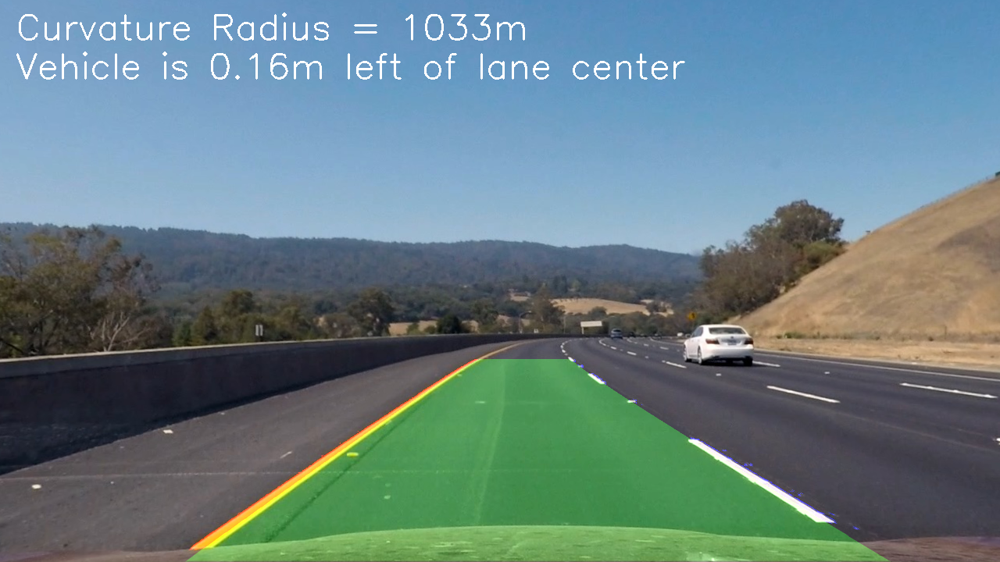

# Advanced Lane Finding

In this project, the goal is to create a software pipeline to identify the lane boundaries in a video takend
from a car-mounted camera, and perform basic calculations of lane curvature radius and lane center deviation.

## The Project

The goals / steps of this project are the following:

* Compute the camera calibration matrix and distortion coefficients given a set of chessboard images.
* Apply a distortion correction to raw images.
* Use color transforms, gradients, etc., to create a thresholded binary image.
* Apply a perspective transform to rectify binary image ("birds-eye view").
* Detect lane pixels and fit to find the lane boundary.
* Determine the curvature of the lane and vehicle position with respect to center.
* Warp the detected lane boundaries back onto the original image.
* Output visual display of the lane boundaries and numerical estimation of lane curvature and vehicle
  position.

The images for camera calibration are stored in the folder called `camera_cal`.  The images in `test_images`
are for testing your pipeline on single frames.

Examples of the output from each stage of the pipeline are saved in the folder called `output_images`,
detailed explaination of image processings are included in the `project_report.md`.

The video file `project_video_output.mp4` is the result video my pipeline produced from raw video `project_video.mp4`.
